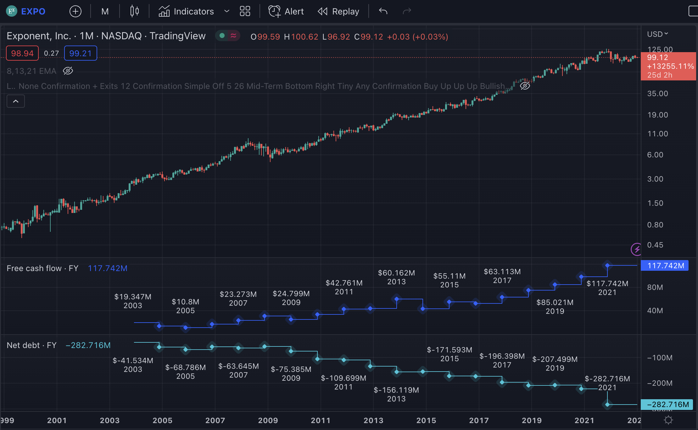

# Overview
Excelsior is a CLI program that finds US stocks and ETF with the best (positive) linear & polynomial fit. This means the least volatile, most consistently growing equities. Here is an example of what we're looking for:
    

Excelsior only looks at the stock's performance. It does not take into account any basic fundemental analysis metrics such as the company's ability to produce steadily growing earnings, decreasing debt, or the P/E ratio. It does however produce a list that could be interesting to take a more serious look at.

Here is the output ran from 01/01/2000 to 01/08/2023. 60 tickers that beat the SPY 500, 30 tickers with the best linear fit, and 30 with the best polynomial fit, and their growth numbers. There are dozens more interesting equities beyond the first 30, especially with a polynomial fit.

    Determined benchmark SPY performance at 2.6386592850236354
    LINEAR FITS...
    Ticker, Fit (R Squared), Growth
    ('SLGN', (0.9521062011120832, 32.049709875606794))
    ('DCI', (0.9301523786190472, 10.133903952205882))
    ('FLO', (0.9276664152270269, 21.1661920676986))
    ('SRE', (0.9262970364683183, 8.955378673567239))
    ('CNI', (0.9254298027851917, 28.121261938156014))
    ('HSIC', (0.91993961562028, 33.28229816589839))
    ('O', (0.9165747949679314, 6.426748617198608))
    ('CTSH', (0.91459984949853, 29.030000686645508))
    ('PB', (0.9119935436204508, 8.702322170529026))
    ('ATR', (0.9108376962980202, 9.366737124794408))
    ('SBSI', (0.9107793896494756, 7.990405410094063))
    ('CMI', (0.9107601921414288, 20.329511796152577))
    ('YUM', (0.9063378494470027, 19.1886217639113))
    ('CHRW', (0.9040223314162303, 9.283067404652556))
    ('PSA', (0.9029642891816635, 12.224614740728022))
    ('CZFS', (0.9023961152477936, 5.289449075236538))
    ('RY', (0.9016777290627644, 8.964678134137428))
    ('RTX', (0.9013504042784183, 5.127512308106955))
    ('JJSF', (0.8997988001044138, 14.57542180440512))
    ('TD', (0.8996709020886888, 4.994123269031398))
    ('WEC', (0.8995728641976938, 9.944131019467212))
    ('RNR', (0.8950019904071239, 13.831111201533565))
    ('SJM', (0.8937980468308803, 8.271372676674837))
    ('UL', (0.8916089367509724, 3.042261959280238))
    ('D', (0.8911794457203587, 3.3159343782018444))
    ('USLM', (0.8909489748900866, 19.59272682883523))
    ('ESGR', (0.8899723338947964, 18.383846576397236))
    ('DEO', (0.889656873998062, 5.606549536275585))
    ('BCPC', (0.8893178973511846, 78.465495773262))
    ('PCAR', (0.8886414509271223, 11.429611163700901))

    POLY FITS...
    Ticker, Fit (R Squared), Growth
    ('WEC', (0.9771661237967224, 9.944131019467212))
    ('CNI', (0.9769236826840616, 28.121261938156014))
    ('JKHY', (0.9756521708177939, 13.18623273982558))
    ('MCD', (0.9754571310479903, 6.672303208793376))
    ('CASY', (0.9747100523143132, 20.42511696039244))
    ('GIB', (0.9740593940152609, 3.780546594838627))
    ('CHD', (0.9737278144479304, 19.105386228222937))
    ('TJX', (0.9734528069985856, 31.45254817973479))
    ('WINA', (0.9733159003804238, 61.003173828125))
    ('BCPC', (0.973029813088756, 78.465495773262))
    ('XLV', (0.9718226836864264, 4.48297084515214))
    ('ROP', (0.9714183168052736, 24.89926131370826))
    ('CPK', (0.9713928625244733, 9.553626896392643))
    ('MNST', (0.971162582176991, 1136.9707242713077))
    ('YUM', (0.9701641850166807, 19.1886217639113))
    ('APH', (0.9695664626510843, 36.89158956158389))
    ('WCN', (0.9691989385625723, 46.23632656992236))
    ('UNP', (0.9674568004703956, 19.43593664958273))
    ('ADP', (0.9673255537929863, 5.790103161291778))
    ('ES', (0.9671321865454605, 4.124713079446752))
    ('XLP', (0.9666149654446505, 3.277362530048077))
    ('NDSN', (0.9649265806565278, 19.285171102661597))
    ('HUM', (0.9648297532826456, 65.0737183626033))
    ('AON', (0.9636513013922909, 7.762051313351362))
    ('BF-B', (0.963580548672014, 10.661062123681054))
    ('LNT', (0.9635227162816791, 4.161491909782925))
    ('HD', (0.9634282374083387, 4.904774856933126))
    ('IEX', (0.9626605125731934, 17.08844711852347))
    ('ROL', (0.9614790856848869, 41.5574925721261))
    ('MMC', (0.9614009692128634, 3.578797233868969))

# Requirements
    Python 3

# Installation
    python -m venv .venv
    . .venv/bin/activate
    pip3 install -r requirements.txt

# Usage
    python3 excelsior/cache.py
    python3 excelsior/analysis.py

# Default Arguments
    python3 cache.py --help. Running with default arguments downloads data for all stocks in all US markets from the beginning of time, this may take a couple of hours.
    python3 analysis.py --help. Outputs 30 tickers with the best linear fit, and 30 with the best polynomial fit (2nd degree), from 2000 to 2023, and uses SPY as the benchmark to beat.
